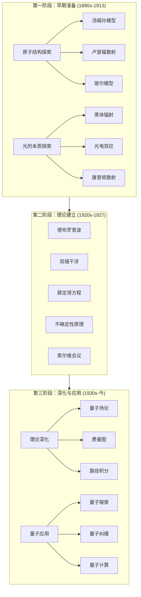

# 量子力学发展历程可视化网站 - 实施计划

## 项目目标

创建一个交互式量子力学教学网站，以"发展历程"为主线，涵盖从经典物理的困境到现代量子应用的完整演变过程。

> [!IMPORTANT]
> **目标受众**：非理科大学生  
> - 可使用高中水平公式（如 E=hv, λ=h/p）  
> - 避免本科理科推导（薛定谔方程求解、算符代数）  
> - 重点在于**物理图像**和**直观动画**

---

## 视觉主题

**量子粒子背景**（替代星空背景）：
- 随机漂浮的发光粒子（电子、光子、质子等）
- 粒子间偶尔出现的连线（量子纠缠暗示）
- 波动效果（物质波）
- 深色渐变背景配合粒子轨迹

---

## 技术架构

| 技术 | 用途 |
|------|------|
| HTML5 | 语义化页面结构 |
| CSS3 | 设计系统、动画、响应式布局 |
| JavaScript (ES6+) | 交互逻辑、Canvas 动画 |
| Canvas API | 物理模拟与可视化 |
| [Marked.js](https://marked.js.org/) | Markdown 渲染 |
| [KaTeX](https://katex.org/) | LaTeX 数学公式渲染 |
| LocalStorage | 内容持久化 |

---

## 内容架构：三阶段发展史



---

## 项目文件结构

```
quantum_new/
├── index.html                 # 主页入口
├── README.md                  # 项目说明
│
├── css/                       # 样式文件
│   ├── main.css              # 设计系统（变量、组件）
│   ├── animations.css        # 关键帧动画库
│   ├── home.css              # 主页专用样式
│   └── page.css              # 内容页通用样式
│
├── js/                        # JavaScript
│   ├── app.js                # 主应用逻辑
│   ├── storage.js            # 本地存储封装
│   ├── quantum-bg.js         # 量子主题背景动画
│   └── simulations/          # 交互演示模块
│       ├── early-era/        # 早期阶段模拟
│       │   ├── rutherford-scattering.js
│       │   ├── bohr-model.js
│       │   ├── blackbody-radiation.js
│       │   └── photoelectric-effect.js
│       ├── middle-era/       # 建立阶段模拟
│       │   ├── de-broglie-wave.js
│       │   ├── double-slit.js
│       │   ├── schrodinger-equation.js
│       │   └── uncertainty-principle.js
│       └── modern-era/       # 现代阶段模拟
│           ├── feynman-diagram.js
│           ├── quantum-tunneling.js
│           ├── bell-inequality.js
│           └── bloch-sphere.js
│
├── pages/                     # 教学页面
│   ├── early-era/            # 第一阶段（12页）
│   │   ├── atom-track/       # 原子结构线（6页）
│   │   │   ├── thomson-model.html
│   │   │   ├── rutherford-scattering.html
│   │   │   ├── bohr-model.html
│   │   │   ├── atomic-spectra.html
│   │   │   ├── electron-cloud.html
│   │   │   └── track-summary.html
│   │   └── light-track/      # 光的本质线（6页）
│   │       ├── wave-interference.html
│   │       ├── blackbody-radiation.html
│   │       ├── photoelectric-effect.html
│   │       ├── compton-scattering.html
│   │       ├── photon-concept.html
│   │       └── track-summary.html
│   │
│   ├── middle-era/           # 第二阶段（6页）
│   │   ├── de-broglie-wave.html
│   │   ├── double-slit.html
│   │   ├── schrodinger-equation.html
│   │   ├── uncertainty-principle.html
│   │   ├── solvay-conference.html
│   │   └── era-summary.html
│   │
│   └── modern-era/           # 第三阶段（10页）
│       ├── theory-track/     # 理论深化线（4页）
│       │   ├── quantum-field-theory.html
│       │   ├── feynman-diagrams.html
│       │   ├── path-integral.html
│       │   └── track-summary.html
│       └── app-track/        # 应用发展线（6页）
│           ├── quantum-tunneling.html
│           ├── quantum-entanglement.html
│           ├── bell-inequality.html
│           ├── quantum-computing.html
│           ├── quantum-cryptography.html
│           └── track-summary.html
│
└── assets/                    # 静态资源
    ├── images/               # 物理学家肖像等
    └── icons/                # 图标
```

---

## 页面与交互设计

### 第一阶段：早期准备 (1890s-1913)

#### 汤姆孙模型 ⭐ 交互

**左侧：阴极射线实验**
- 展示阴极射线管装置
- 用户可调节电场强度和磁场强度
- 演示如何利用安培力/洛伦兹力偏转射线
- 显示荷质比 e/m 的测量原理

**右侧：葡萄干布丁模型**
- 正电荷均匀分布的"布丁"球体
- 电子作为"葡萄干"嵌入其中
- 电子做微小热振动动画（被束缚，不能飞出）

---

#### 卢瑟福散射 ⭐ 交互

**中间：散射实验对比**
- **上方**：葡萄干布丁模型 → α粒子穿透时几乎不偏转
- **下方**：核式结构模型 → 大角度散射，部分反弹
- 用户发射α粒子，观察两种模型的散射差异

**右侧：卢瑟福行星模型**
- 中心为致密原子核
- 电子在各种椭圆轨道上运动
- 可调节轨道倾角和离心率

---

#### 玻尔模型 ⭐ 交互
- 点击能级触发电子跃迁
- 显示发射/吸收光子
- 对应氢原子光谱线

---

#### 黑体辐射 ⭐ 交互

**左侧：直观演示**
- 绘制一个"黑盒子"
- 温度滑块（1000K - 10000K）
- 盒子颜色随温度变化（维恩位移定律）
- 盒子亮度随温度变化（斯特凡-玻尔兹曼定律 P∝T^4）

**右侧：辐射曲线对比**
- 普朗克曲线（正确理论）
- 瑞利-金斯曲线（经典物理 → 紫外灾难）
- 维恩曲线（经验公式）
- 曲线随温度动态变化

---

#### 光电效应 ⭐ 交互
- 调节光的频率和强度
- 观察电子发射行为
- 展示截止频率、逸出功概念

#### 康普顿散射
- 演示 X 射线与电子碰撞后波长变化

### 第二阶段：理论建立 (1920s-1927)

| 页面 | 交互类型 | 描述 |
|------|----------|------|
| **德布罗意波** | ⭐ 交互 | 调节粒子动量，观察物质波波长变化 |
| **双缝干涉** | ⭐ 交互 | 切换经典/量子模式，单粒子逐个发射看干涉条纹形成 |
| **薛定谔方程** | ⭐ 交互 | 波函数在不同势阱中的时间演化动画 |
| **不确定性原理** | ⭐ 交互 | 位置-动量跷跷板，压缩一个导致另一个扩展 |
| 索尔维会议 | 演示 | 历史人物介绍，爱因斯坦-玻尔论战回顾 |

### 第三阶段：深化与应用 (1930s-今)

| 页面 | 交互类型 | 描述 |
|------|----------|------|
| 量子场论 | 演示 | 场的量子化概念可视化 |
| **费曼图** | ⭐ 交互 | 拖拽粒子线条，自动生成合法费曼图 |
| 路径积分 | 演示 | 多路径叠加概念动画 |
| **量子隧穿** | ⭐ 交互 | 调节势垒高度/宽度，观察隧穿概率变化 |
| **量子纠缠** | ⭐ 交互 | 贝尔不等式实验，调节探测器角度，统计相关性 |
| **量子计算** | ⭐ 交互 | Bloch球上应用X/Y/Z/H门，观察量子比特状态变化 |
| 量子通信 | 演示 | BB84协议流程展示 |

---

## 实施计划

### 阶段 1：基础架构 (预计 2-3 天)

1. **[NEW] 项目目录结构**
   - 创建 `quantum_new/` 下的完整目录结构

2. **[NEW] CSS 设计系统** 
   - [main.css](file:///c:/Users/epiphyllum/OneDrive/Projects/ai4teaching/quantum_new/css/main.css)：基于 relativity 项目适配
   - [animations.css](file:///c:/Users/epiphyllum/OneDrive/Projects/ai4teaching/quantum_new/css/animations.css)：动画库
   - [home.css](file:///c:/Users/epiphyllum/OneDrive/Projects/ai4teaching/quantum_new/css/home.css)：主页样式
   - [page.css](file:///c:/Users/epiphyllum/OneDrive/Projects/ai4teaching/quantum_new/css/page.css)：内容页样式

3. **[NEW] 核心 JS 模块**
   - [app.js](file:///c:/Users/epiphyllum/OneDrive/Projects/ai4teaching/quantum_new/js/app.js)
   - [storage.js](file:///c:/Users/epiphyllum/OneDrive/Projects/ai4teaching/quantum_new/js/storage.js)
   - [quantum-bg.js](file:///c:/Users/epiphyllum/OneDrive/Projects/ai4teaching/quantum_new/js/quantum-bg.js)

4. **[NEW] 主页**
   - [index.html](file:///c:/Users/epiphyllum/OneDrive/Projects/ai4teaching/quantum_new/index.html)：三阶段导航入口

---

### 阶段 2：第一阶段页面 (预计 3-4 天)

优先实现带交互的核心页面：
1. 卢瑟福散射 (α粒子交互)
2. 玻尔模型 (能级跃迁交互)
3. 黑体辐射 (温度调节交互)
4. 光电效应 (频率/强度交互)

---

### 阶段 3：第二阶段页面 (预计 3-4 天)

1. 双缝干涉 (经典/量子模式切换)
2. 薛定谔方程 (波函数演化)
3. 不确定性原理 (位置-动量跷跷板)
4. 德布罗意波 (物质波展示)

---

### 阶段 4：第三阶段页面 (预计 4-5 天)

1. 量子隧穿 (势垒参数交互)
2. 量子纠缠/贝尔不等式 (探测器角度交互)
3. 量子计算/Bloch球 (量子门操作)
4. 费曼图 (拖拽式构建)

---

## 验证计划

### 自动化测试
由于这是一个纯前端静态网站，我们将使用浏览器工具进行功能验证：
- **运行命令**: 在 `quantum_new` 目录下执行 `npx serve .` 启动本地服务器
- **浏览器测试**: 使用 browser_subagent 工具访问各页面，验证：
  - 页面正确加载
  - Canvas 动画正常运行
  - 交互控件响应正确
  - 量子粒子背景正常显示

### 手动验证
完成每个阶段后，请您：
1. 在浏览器中打开 `index.html`
2. 检查页面视觉效果是否符合预期
3. 测试交互模拟的物理行为是否正确
4. 验证响应式布局在不同屏幕尺寸下的表现

---

## 开发顺序建议

> [!IMPORTANT]
> 建议按以下优先级实现，确保核心功能先行：

1. **基础架构** → 主页可访问
2. **卢瑟福散射** → 作为第一个交互模拟的参考实现
3. **玻尔模型 + 光电效应** → 第一阶段核心
4. **双缝干涉 + 不确定性原理** → 第二阶段核心
5. **量子隧穿 + 量子纠缠** → 第三阶段核心
6. **其余页面** → 按需补充

---

## 用户确认

请确认以下事项后即可开始实施：

1. **内容范围**：28个页面的规划是否合适？
2. **开发顺序**：同意先实现基础架构，然后按汤姆孙模型→卢瑟福散射→玻尔模型→黑体辐射→光电效应的顺序推进？
3. **量子主题背景**：使用漂浮粒子+波动效果替代星空背景？
